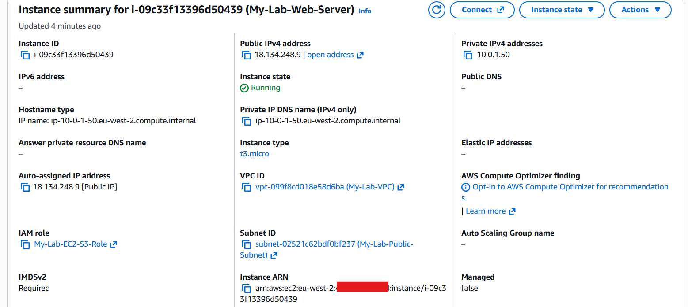
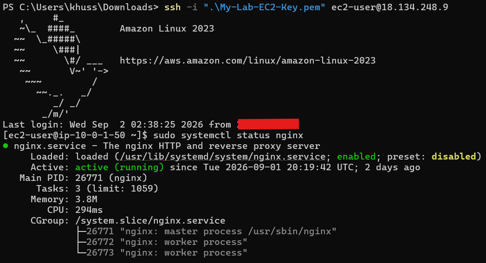
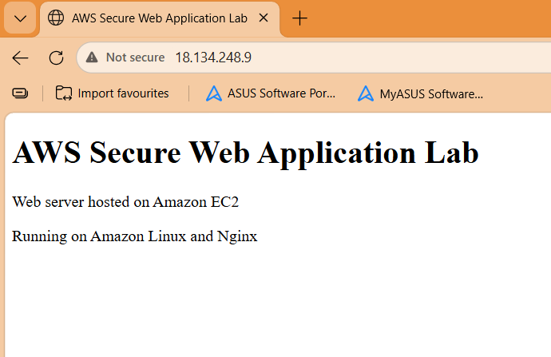

# EC2 Web Server

## Overview

An Amazon EC2 instance was deployed into the public subnet configured during the networking stage.

The instance hosts the web application and runs Amazon Linux 2023 with Nginx. It was configured for remote administration through SSH and HTTP access through its public IPv4 address.

## EC2 Configuration

**Name:** `My-Lab-Web-Server`
**Instance Type:** `t3.micro`

The instance was deployed using the VPC, public subnet and Security Group configured during the networking stage.

### Configuration

| Configuration    | Value                  |
| ---------------- | ---------------------- |
| Operating System | Amazon Linux 2023      |
| Instance Type    | `t3.micro`             |
| VPC              | `My-Lab-VPC`           |
| Subnet           | `My-Lab-Public-Subnet` |
| Public IPv4      | Enabled                |
| Security Group   | `My-Lab-SecurityGroup` |
| SSH Key Pair     | `My-Lab-EC2-Key`       |

The instance successfully launched and passed the AWS system and instance status checks.

### Screenshot



---

## SSH Access

The EC2 instance was accessed remotely using SSH from Windows PowerShell.

SSH access is restricted to my public IP address through the EC2 Security Group.

The private key associated with `My-Lab-EC2-Key` was stored locally and was not uploaded to the GitHub repository.

The SSH connection was established using:

```bash
ssh -i ".\My-Lab-EC2-Key.pem" ec2-user@YOUR_PUBLIC_IP
```

The private key itself is not included in the project repository.

### Screenshot



---

## Nginx Web Server

Nginx was installed on the Amazon Linux instance and configured to serve the web application.

The following commands were used during configuration:

```bash
sudo dnf update -y
sudo dnf install nginx -y
sudo systemctl start nginx
sudo systemctl enable nginx
sudo systemctl status nginx
```

The Nginx service was enabled to start automatically when the instance boots.

The service status was checked to confirm that Nginx was active and running.

---

## Custom Web Page

The default Nginx welcome page was replaced with a custom HTML page created for the project.

The page displays:

> **AWS Secure Web Application Lab**
> Web server hosted on Amazon EC2
> Running on Amazon Linux and Nginx

The page was accessed using the EC2 instance's public IPv4 address.

### Screenshot



---

## Security Considerations

* SSH access is restricted to my public IP address.
* The EC2 private key is stored locally and is not committed to the repository.
* No AWS access keys, passwords or other credentials are stored in the project.

The network-level security configuration is documented in [Networking](networking.md).

---

## Validation

The EC2 deployment was validated through the following checks:

* EC2 instance status checks passed.
* SSH connectivity was established successfully.
* Nginx service was confirmed as active.
* HTTP access to the public IP address was successful.
* The custom web page was served correctly.

These checks confirmed that the EC2 instance and web server were operating as intended.
