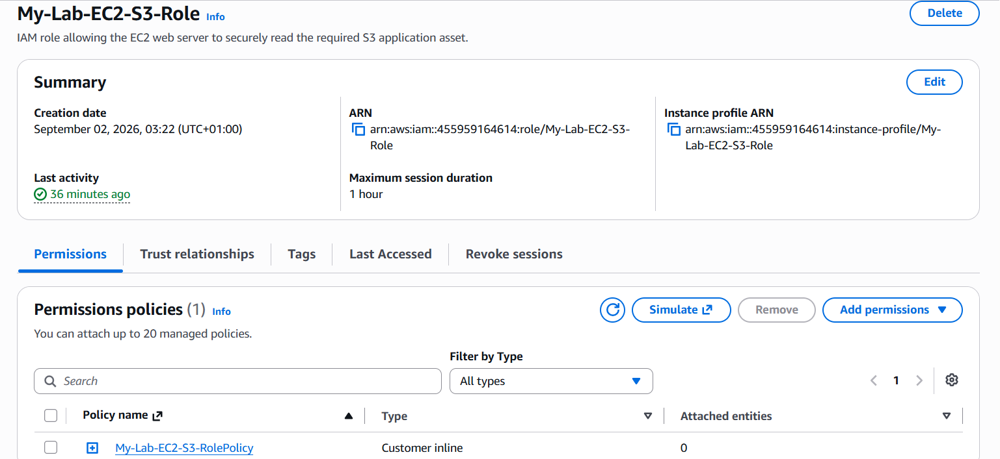
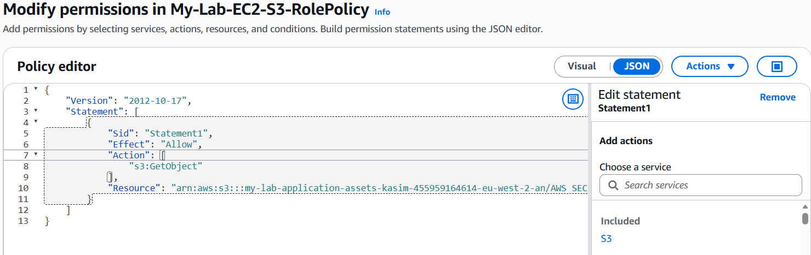
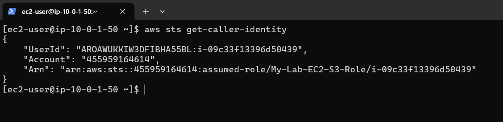
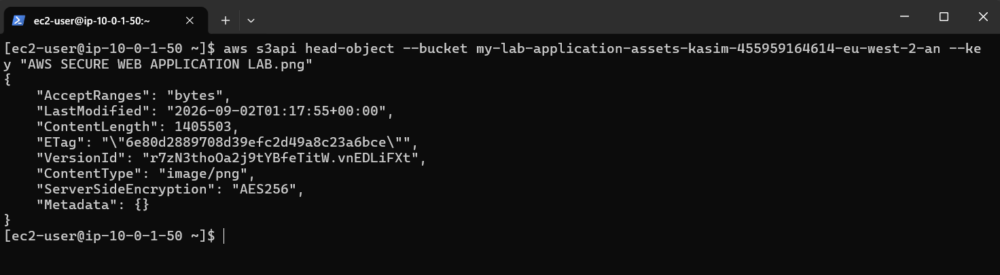
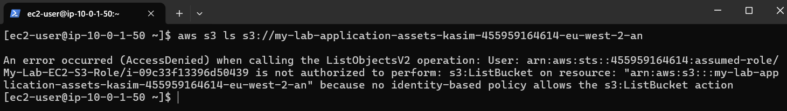

# IAM and Least Privilege

## Overview

AWS Identity and Access Management (IAM) was used to control access between the EC2 web server and the private S3 bucket.

The objective was to allow the EC2 instance to retrieve the specific application asset it required without granting unnecessary S3 permissions.

An IAM role was attached to the EC2 instance with a custom inline policy implementing least-privilege access at both the **action** and **resource** level.

---

## IAM Role

**Role:** `My-Lab-EC2-S3-Role`
**Trusted Entity:** EC2

The IAM role was created for the EC2 service and attached to `My-Lab-Web-Server`.

Using an IAM role allows the EC2 instance to obtain temporary AWS credentials when communicating with AWS services, avoiding the need to store long-term AWS access keys on the server.

### Screenshot



The role is associated with the custom `My-Lab-EC2-S3-RolePolicy` inline policy.

---

## Least-Privilege Policy

**Policy:** `My-Lab-EC2-S3-RolePolicy`

A custom inline policy was created to provide only the permission required by the workload.

The policy grants:

* `s3:GetObject`

The permission is restricted to the specific application asset:

```text
arn:aws:s3:::my-lab-application-assets-kasim-455959164614-eu-west-2-an/AWS SECURE WEB APPLICATION LAB.png
```

### Policy

```json
{
  "Version": "2012-10-17",
  "Statement": [
    {
      "Sid": "Statement1",
      "Effect": "Allow",
      "Action": [
        "s3:GetObject"
      ],
      "Resource": "arn:aws:s3:::my-lab-application-assets-kasim-455959164614-eu-west-2-an/AWS SECURE WEB APPLICATION LAB.png"
    }
  ]
}
```

### Screenshot



This restricts the EC2 instance to retrieving the required object and does not grant permissions to list the bucket, upload objects, delete objects or modify other S3 objects.

This demonstrates least-privilege access at both the **action** and **resource** level.

---

## EC2 Role Association

The `My-Lab-EC2-S3-Role` was attached to the `My-Lab-Web-Server` EC2 instance.

The resulting access path is:

```text
EC2 Web Server
      |
      v
IAM Role
      |
      v
IAM Policy
      |
      v
s3:GetObject
      |
      v
Specific S3 Application Asset
```

The EC2 instance can therefore access the required S3 resource using temporary role credentials rather than manually configured AWS access keys.

---

## IAM Role Validation

The role assignment was validated from inside the EC2 instance using the AWS CLI.

```bash
aws sts get-caller-identity
```

### Screenshot



The response confirmed that the EC2 instance was operating under the `My-Lab-EC2-S3-Role` assumed-role identity.

This verified that the EC2 instance was successfully using the assigned IAM role.

---

## Allowed S3 Access

The permitted S3 access was tested using:

```bash
aws s3api head-object --bucket my-lab-application-assets-kasim-455959164614-eu-west-2-an --key "AWS SECURE WEB APPLICATION LAB.png"
```

The request successfully returned metadata for the specified object.

### Screenshot



The successful response confirms that the EC2 instance has the required `s3:GetObject` permission for the specified application asset.

The response also returned object metadata including the version ID and server-side encryption information.

---

## Denied S3 Access

A negative test was performed to verify that permissions outside the policy were not available.

The following command attempted to list the contents of the S3 bucket:

```bash
aws s3 ls s3://my-lab-application-assets-kasim-455959164614-eu-west-2-an
```

The policy does not grant `s3:ListBucket`.

### Screenshot



The AWS CLI returned an `AccessDenied` error, which was the expected result.

The tests therefore demonstrate both permitted and restricted access:

```text
Allowed
EC2 → s3:GetObject → Specific S3 Object → Success

Denied
EC2 → s3:ListBucket → S3 Bucket → AccessDenied
```

This provides practical validation that the IAM policy is enforcing the intended access boundary.

---

## Security Considerations

The IAM configuration applies least-privilege principles by:

* Using an EC2 IAM role instead of long-term AWS access keys.
* Granting only `s3:GetObject`.
* Restricting access to a specific S3 object.
* Validating both successful and deliberately denied access.

The configuration limits the S3 resources and actions available to the EC2 workload to those required by the application.
