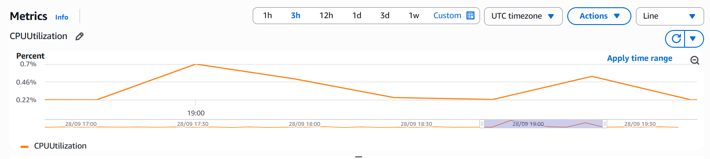
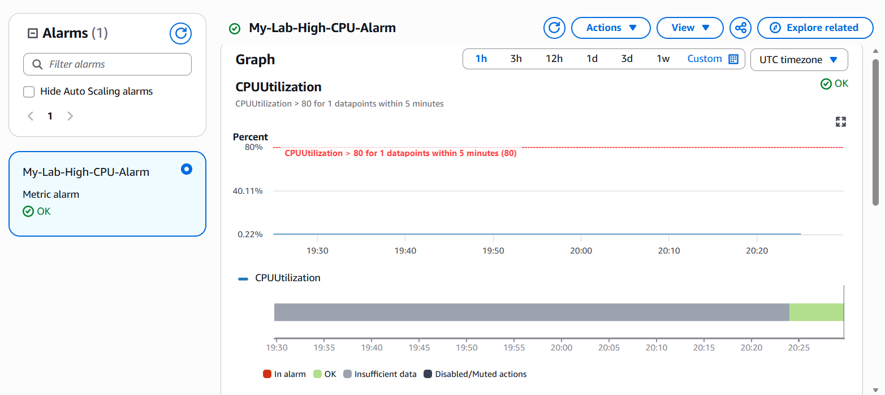

# CloudWatch Monitoring

## Overview

Amazon CloudWatch was used to monitor the EC2 web server and provide basic operational alerting.

The monitoring configuration focuses on CPU utilisation for `My-Lab-Web-Server`. A CloudWatch alarm was configured to identify high CPU utilisation and publish an alert through Amazon SNS.

The resulting monitoring flow is:

```text
EC2 Web Server
      |
      v
CPUUtilization
      |
      v
CloudWatch Alarm
      |
      v
SNS Topic
      |
      v
Email Notification
```

---

## EC2 CPU Monitoring

CloudWatch automatically collects standard monitoring metrics for the EC2 instance.

The `CPUUtilization` metric was selected to provide visibility into processor utilisation for `My-Lab-Web-Server`.

### Configuration

| Configuration | Value                           |
| ------------- | ------------------------------- |
| Instance      | `My-Lab-Web-Server`             |
| Metric        | `CPUUtilization`                |
| Statistic     | Average                         |
| Monitoring    | CloudWatch standard EC2 metrics |

### Screenshot



The screenshot shows the `CPUUtilization` metric for the EC2 web server and provides visibility into CPU utilisation over time.

---

## CloudWatch Alarm

A CloudWatch alarm named `My-Lab-High-CPU-Alarm` was configured against the EC2 `CPUUtilization` metric.

The alarm is configured to enter an alarm state when average CPU utilisation exceeds **80%** over the configured evaluation period.

### Configuration

| Configuration     | Value                   |
| ----------------- | ----------------------- |
| Alarm             | `My-Lab-High-CPU-Alarm` |
| Metric            | `CPUUtilization`        |
| Statistic         | Average                 |
| Threshold         | Greater than 80%        |
| Evaluation Period | 5 minutes               |
| Evaluation        | 1 out of 1 datapoints   |

The alarm provides a basic operational threshold for identifying unusually high CPU utilisation on the web server.

### Screenshot



The screenshot shows the configured CloudWatch alarm, including the CPU utilisation threshold and current alarm configuration.

---

## SNS Notification

Amazon Simple Notification Service (SNS) was configured to provide email notifications when the CloudWatch alarm enters the configured alarm state.

An SNS topic was created for the CloudWatch alarm and an email subscription was confirmed.

The email address used for the subscription is intentionally not documented in the repository.

This provides an automated notification path from the EC2 monitoring metric through CloudWatch and SNS to an email recipient.

---

## Validation

The monitoring configuration was validated by:

* Confirming that CloudWatch was receiving `CPUUtilization` metrics for `My-Lab-Web-Server`.
* Confirming that `My-Lab-High-CPU-Alarm` was created with the intended threshold.
* Confirming that the SNS topic was associated with the alarm.
* Confirming the SNS email subscription.

The configuration provides basic monitoring and alerting for the EC2 workload without introducing unnecessary monitoring components for the scope of this lab.

---

## Monitoring Considerations

The current configuration provides basic CPU monitoring and alerting.

A production environment could extend this further with additional metrics, application-level monitoring, log collection, dashboards and service-specific alarms based on actual workload requirements.
