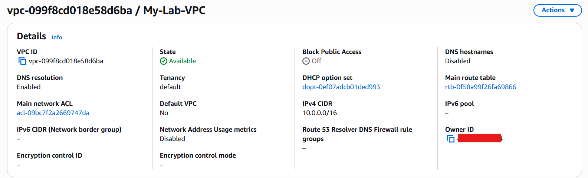
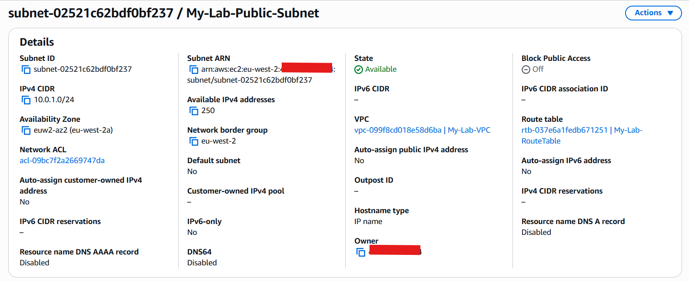
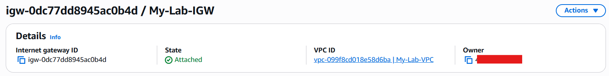
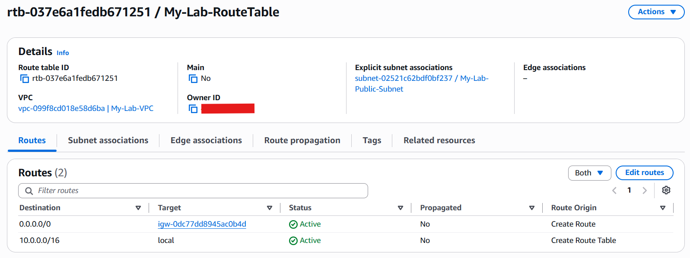
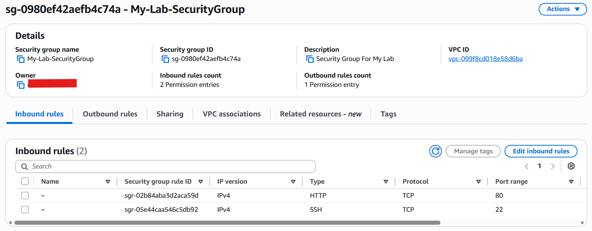

# AWS Networking

## Overview

The networking layer provides the foundation for the web application environment. It consists of a custom VPC, public subnet, Internet Gateway, route table and Security Group.

The configuration was created manually through the AWS Management Console and validated before deploying the EC2 web server.

## VPC

**Name:** `My-Lab-VPC`
**CIDR:** `10.0.0.0/16`

A dedicated VPC was created using the `10.0.0.0/16` CIDR range. This provides the main network boundary for the environment and allows the address space to be divided into smaller subnets.

The public subnet used by the web server is allocated from this range using `10.0.1.0/24`.

### Configuration

* IPv4 CIDR: `10.0.0.0/16`
* IPv6: Disabled
* Tenancy: Default

### Screenshot



---

## Public Subnet

**Name:** `My-Lab-Public-Subnet`
**CIDR:** `10.0.1.0/24`

A `/24` subnet was created within the VPC for the EC2 web server.

The subnet is considered public because its associated route table contains a default route to the Internet Gateway. The EC2 instance also receives a public IPv4 address so that the web application can be accessed externally.

### Configuration

* VPC: `My-Lab-VPC`
* CIDR: `10.0.1.0/24`
* Type: Public
* Availability Zone: London region

### Screenshot



---

## Internet Gateway

**Name:** `My-Lab-IGW`

An Internet Gateway was created and attached to `My-Lab-VPC`.

It provides the connection between the VPC and the internet. The Internet Gateway works together with the route table to allow internet-bound traffic from the public subnet.

### Configuration

* Internet Gateway: `My-Lab-IGW`
* Attached VPC: `My-Lab-VPC`

### Screenshot



---

## Route Table

**Name:** `My-Lab-RouteTable`

A dedicated route table was created and associated with `My-Lab-Public-Subnet`.

### Routes

| Destination   | Target       |
| ------------- | ------------ |
| `10.0.0.0/16` | Local        |
| `0.0.0.0/0`   | `My-Lab-IGW` |

The local route allows communication within the VPC.

The `0.0.0.0/0` route directs traffic destined outside the VPC to the Internet Gateway, allowing the subnet to provide internet connectivity when the required public addressing and security rules are in place.

### Screenshot



---

## Security Group

**Name:** `My-Lab-SecurityGroup`

The Security Group controls inbound and outbound network traffic for the EC2 web server.

### Inbound Rules

| Protocol | Port | Source      | Purpose            |
| -------- | ---: | ----------- | ------------------ |
| TCP      |   80 | `0.0.0.0/0` | HTTP web traffic   |
| TCP      |   22 | My IP       | SSH administration |

HTTP is open to the internet because the web server needs to be publicly accessible.

SSH is restricted to my public IP address rather than being exposed to all sources.

The default outbound rule remains enabled to allow the instance to initiate required connections.

### Security Considerations

Only the ports required for the application and administration were opened.

Port 80 is publicly accessible because it is required to access the web server.

Port 22 is restricted to my IP address to reduce unnecessary exposure.

### Screenshot



---

## Network Flow

```text
Internet
    |
    v
Internet Gateway
    |
    v
My-Lab-VPC
10.0.0.0/16
    |
    v
My-Lab-Public-Subnet
10.0.1.0/24
    |
    v
My-Lab-SecurityGroup
    |
    v
EC2 Web Server
```

This provides the network foundation for the EC2 web server and allows controlled internet access through the Internet Gateway and Security Group.
