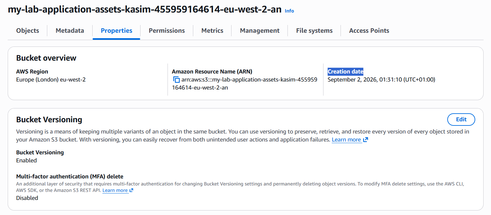
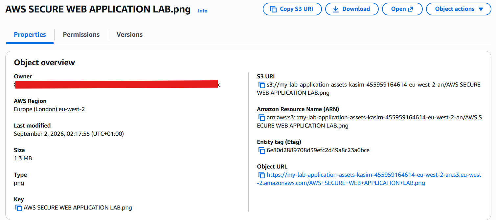

# Amazon S3

## Overview

Amazon S3 was used to provide private object storage for application assets within the AWS environment.

A dedicated S3 bucket was created in the London AWS Region and configured with security controls to prevent public access. An application image was uploaded to the bucket as an example of an asset that could be stored and accessed by the environment.

## S3 Bucket Configuration

**Bucket Name:** `my-lab-application-assets-kasim-455959164614-eu-west-2-an`
**Region:** `eu-west-2` — Europe (London)

The bucket was created using the account regional namespace and configured to remain private.

### Configuration

| Configuration       | Value                         |
| ------------------- | ----------------------------- |
| AWS Region          | Europe (London) — `eu-west-2` |
| Namespace           | Account regional namespace    |
| Object Ownership    | Bucket owner enforced         |
| Block Public Access | Enabled                       |
| Bucket Versioning   | Enabled                       |
| Encryption          | SSE-S3                        |
| Bucket Key          | Enabled                       |

### Screenshot

---

## Public Access Protection

All S3 Block Public Access settings were enabled.

This prevents the bucket and its objects from being exposed through public access settings or policies.

The application asset does not require public access, so the bucket remains private.

---

## Object Ownership

Object Ownership was configured as **Bucket owner enforced**.

This disables the use of S3 Access Control Lists (ACLs) and ensures that objects uploaded to the bucket are owned by the AWS account that owns the bucket.

This provides a consistent permissions model and supports IAM-based access control.

---

## Bucket Versioning

S3 Bucket Versioning was enabled.

Versioning allows multiple versions of an object to be retained when objects are modified or deleted.

This provides additional protection against accidental changes or deletion and allows previous versions of objects to be recovered where required.

---

## Encryption

The bucket uses server-side encryption with **Amazon S3 managed keys (SSE-S3)**.

SSE-S3 provides encryption at rest for objects stored within the bucket without requiring application-level encryption.

S3 Bucket Key is enabled as part of the bucket's encryption configuration.

---

## Application Asset

An application image was uploaded to the S3 bucket as an example of an asset that could be stored by the application.

The uploaded object is:

`AWS SECURE WEB APPLICATION LAB.png`

The object remains private and is not publicly accessible.

### Screenshot

---

## Validation

The S3 configuration was validated by checking the bucket settings and uploaded object.

Validation included:

* Bucket region confirmed as `eu-west-2`.
* Block Public Access confirmed as enabled.
* Object Ownership confirmed as bucket owner enforced.
* Versioning confirmed as enabled.
* Server-side encryption confirmed as SSE-S3.
* Bucket Key confirmed as enabled.
* Application asset successfully uploaded.
* Object remained private within the bucket.

The S3 configuration was also tested through the EC2 IAM role to confirm controlled access to the required object.

---

## Security Considerations

The bucket was configured with security controls appropriate for private application assets.

* Public access is blocked.
* Objects remain private.
* Server-side encryption is enabled.
* Versioning is enabled.
* Object ownership is controlled by the bucket owner.
* No AWS credentials or sensitive information are stored in the bucket.

Access to the S3 object is controlled through IAM rather than public access.
